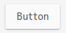

# Flat-Plat

A Material Design-like flat theme for GTK3, GTK2, and GNOME Shell.

## Features

* Supports ripple effect animations (only GTK3 apps).
* Supports both light and dark variants.
* Supports [Dash to Dock](https://micheleg.github.io/dash-to-dock/) extension's theming.
* Supports Chrome's theme and scrollbars extensions.
* Appears more beautiful when you use a font family that including `Medium` and `Light` weight.
## Requirements

* GNOME/GTK+ 3.14, 3.16, 3.18 or 3.20
* The `gnome-themes-standard` package for GTK2
* The pixmap (or pixbuf) engine for GTK2

> _If default Adwaita works fine, it should also works fine._

1. Download a archive.
## Installation

  * [3.20.20160404](https://github.com/nana-4/Flat-Plat/releases/download/3.20.20160404/Flat-Plat-3.20.20160404.tar.gz) for GNOME 3.20
  * [3.18.20160404](https://github.com/nana-4/Flat-Plat/releases/download/3.18.20160404/Flat-Plat-3.18.20160404.tar.gz) for GNOME 3.18
  * [3.16.20151025](https://github.com/nana-4/Flat-Plat/releases/download/3.16.20151025/Flat-Plat-3.16.20151025.tar.gz) for GNOME 3.16
  * [3.14.20150419](https://github.com/nana-4/Flat-Plat/releases/download/3.14.20150419/Flat-Plat-3.14.20150419.tar.gz) for GNOME 3.14
2. Extract it to the themes directory.
  * For system-wide installation to `/usr/share/themes`
  * For user-specific installation to `~/.themes`
3. Use `gnome-tweak-tool` to change the theme.
4. Optionally, open the `chrome` folder and drag and drop the .crx files onto the Chrome's extensions page (`chrome://extensions/`).
## GDM (Lock/Login Screen)

To change the GDM theme, you need to rewrite a system file.  
Please **be careful** because if it fails, desktop environment may not operate correctly.
> **Notes:**
> * Not supported for GNOME 3.14, sorry.
> * When applying this, other shell themes might look broken.

### Install
1. Backup an existing .gresource file. _(Skip this step when you just update it.)_

        sudo cp /usr/share/gnome-shell/gnome-shell-theme.gresource /usr/share/gnome-shell/gnome-shell-theme.gresource~
2. Replace with the new one.
  * If you put this theme in `/usr/share/themes`:

          sudo cp /usr/share/themes/Flat-Plat/gnome-shell/gnome-shell-theme.gresource /usr/share/gnome-shell
  * If you put this theme in `~/.themes`:

          sudo cp ~/.themes/Flat-Plat/gnome-shell/gnome-shell-theme.gresource /usr/share/gnome-shell
3. Restart GNOME Shell (press `Alt`+`F2`, then type `r`).

### Uninstall
1. Restore to original theme from the backup.

        sudo mv -f /usr/share/gnome-shell/gnome-shell-theme.gresource~ /usr/share/gnome-shell/gnome-shell-theme.gresource
2. Restart GNOME Shell (press `Alt`+`F2`, then type `r`).

## Screenshots

* Supports full dark theme (sorry for the delay...)
## Planned Features

* Re-supports Metacity theme
* Totally rewrite the code and images for GTK2
* Supports Unity theme
* Supports Firefox theme
* Supports overlay scrollbars for Chrome extension
* GNOME Terminal color pallet (if possible)
* Material Design-like cursor theme
## Other Info

* License: GPL
* Font: [M+ 1C](https://mplus-fonts.osdn.jp/) 10.5pt
* Chrome's scrollbars extension forked from [Adwaita Scrollbars](https://github.com/gnome-integration-team/chrome-gnome-scrollbar). Thanks for original author.
