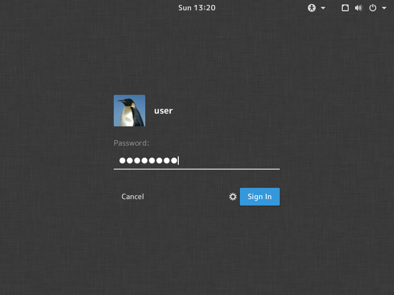
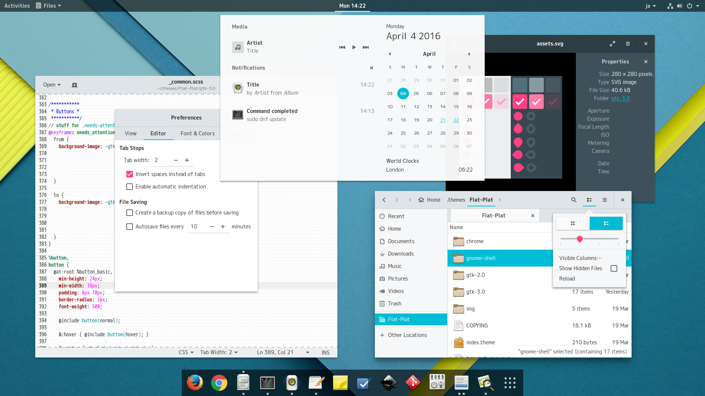
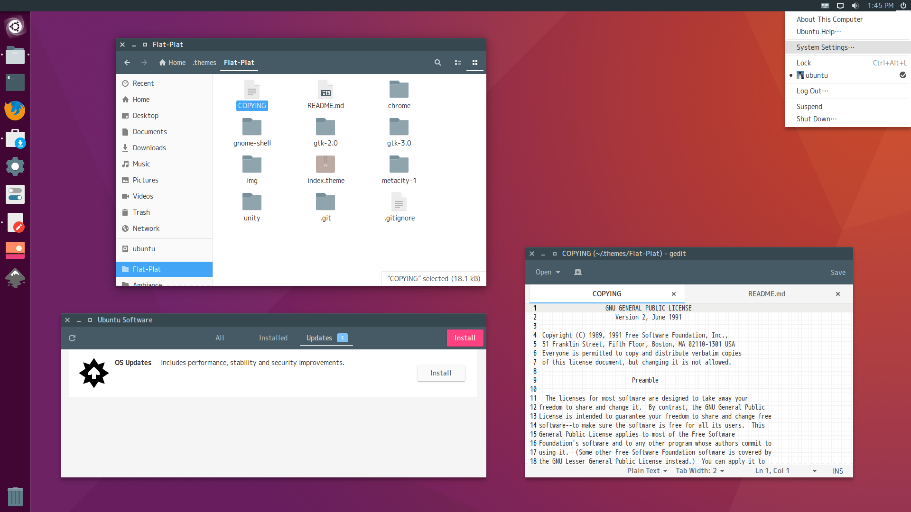
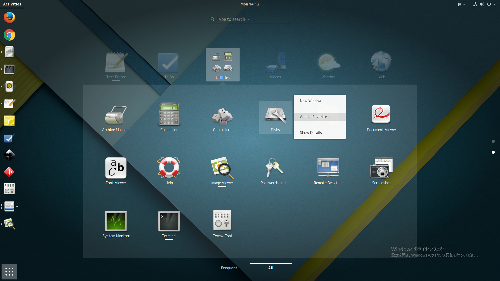

Flat-Plat
=========

A Material Design-like flat theme for GTK3, GTK2, and GNOME-Shell.  
This theme requires GNOME 3.14 / 3.16 / 3.18, and doesn't work properly with other versions.

Installation
------------
1. Extract the archive to the themes directory (`/usr/share/themes` or `~/.themes`).
2. Use `gnome-tweak-tool` to change the theme.
3. Optionally, open the `chrome` folder and drag and drop the .crx files onto the Chrome's extensions page (`chrome://extensions/`).

GDM (a.k.a. Login Screen)
-------------------------
**In order to apply this theme to the login screen, you need the following steps:**

1. Backup and replace .gresource files.

        sudo cp -b /usr/share/themes/Flat-Plat/gnome-shell/gnome-shell-theme.gresource /usr/share/gnome-shell
2. Restart gnome shell (press `Alt`+`F2`, then type `r`).
3. Done!

**In order to restore original theme, type the following command:**

    sudo mv -f /usr/share/gnome-shell/gnome-shell-theme.gresource~ /usr/share/gnome-shell/gnome-shell-theme.gresource

> **NOTE:**
> * **Be careful** if you experiment, as replacing system files could render your system unbootable.
> * When applying this, other shell themes might look broken.

Screenshots
-----------

Other Info
----------
* Font: `M+ 1C`
http://mplus-fonts.sourceforge.jp/mplus-outline-fonts/index-en.html
* Reference color scheme:
http://flatuicolors.com/
* License: GPL
